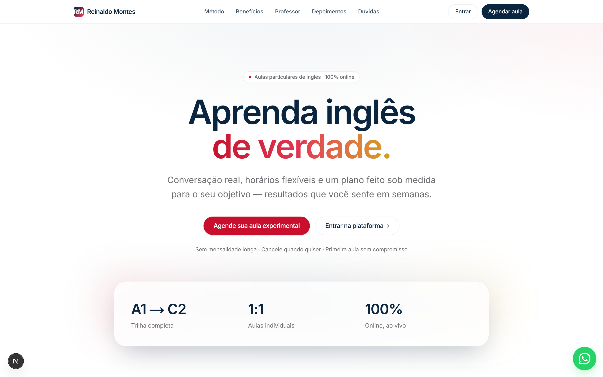
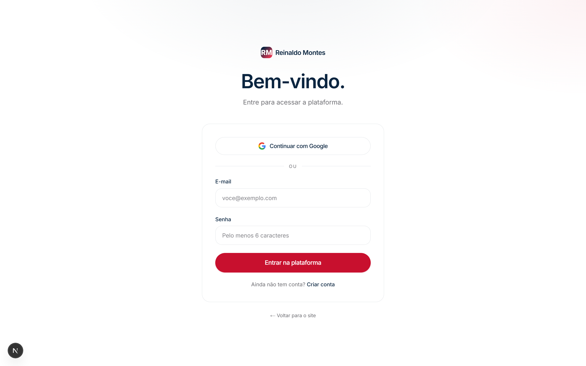

# Reinaldo Montes — Plataforma de Inglês

Site institucional de aulas particulares de inglês (método Oxford) com uma
**plataforma de estudos** acoplada: biblioteca de **materiais** para download,
**aulas gravadas** em cronologia e **flashcards** com repetição espaçada.

O professor publica o conteúdo; os alunos acessam com **login real** (Google ou
e-mail/senha). O papel professor/aluno vem de uma allowlist de e-mails no banco.

---

## Telas

**Landing**



**Login da plataforma**



<!--
Prints das telas internas (exigem login) — para adicionar:
1. Tire o print da tela (painel do professor, materiais, aulas, flashcards).
2. Salve em docs/screenshots/ (ex.: professor.png, materiais.png, aulas.png).
3. Referencie aqui:  
-->

---

## Funcionalidades

- **Login real** — Google OAuth ou e-mail/senha (Supabase Auth). Papel
  aluno/professor definido por allowlist no banco.
- **Materiais** — o professor cria seções ordenadas e anexa arquivos
  (PDF, áudio, imagem, planilha); o aluno baixa direto.
- **Aulas gravadas** — cronologia de aulas com vídeo (link do YouTube/Vimeo) e
  marcação de "assistida" por aluno.
- **Flashcards** — decks privados por usuário com repetição espaçada (SM-2
  simplificado, 3 botões: errei / acertei / fácil).
- **Responsivo** — testado de 320px a 1920px+, visual Apple + cores Oxford.

---

## Stack

| Camada | Tecnologia |
|---|---|
| Framework | Next.js 16 (App Router, Turbopack) |
| Linguagem | TypeScript |
| Estilos | Tailwind v4 |
| Backend | Supabase (Postgres + Auth + Storage) |
| Estado | React Context (hidratado do Supabase) |
| Deploy | Vercel |

---

## Como rodar localmente

```bash
npm install
npx next dev -p 3000
```

Abra [http://localhost:3000](http://localhost:3000).

Para o build de produção (valida TypeScript e rotas):

```bash
npx next build
```

---

## Configuração do Supabase (uma vez)

1. No **SQL Editor** do projeto, rode as migrações **em ordem**:
   `supabase/migrations/0001_init.sql` → `0002_checkpoint_video_upload.sql` →
   `0003_free_tier_limits.sql`.
2. Cadastre o(s) e-mail(s) de professor:
   ```sql
   insert into public.teacher_emails (email) values ('professor@exemplo.com');
   ```
3. No dashboard: ative o provider **Google**, desligue **Confirm email** e
   configure **Site URL** / **Redirect URLs**.
4. Preencha o `.env` (local) e as variáveis na Vercel (produção):
   ```
   NEXT_PUBLIC_SUPABASE_URL=...
   NEXT_PUBLIC_SUPABASE_ANON_KEY=...   # publishable key
   ```
   A *secret key* nunca vai para o front — o app só usa a publishable; RLS é a
   barreira de segurança.

> **Plano FREE do Supabase**: upload limitado a **50MB por arquivo**, **1GB** de
> Storage total, **5GB** de egress/mês, e o projeto **pausa após ~7 dias sem
> uso**. Por isso o **vídeo das aulas é link do YouTube** (não upload). Ao criar
> a aula, envie o vídeo no YouTube como **"Não listado"** e cole o link.

---

## Documentação completa

O briefing técnico detalhado (arquitetura, modelo de dados, convenções, dívidas
conhecidas) está em **[CLAUDE.md](CLAUDE.md)**.
